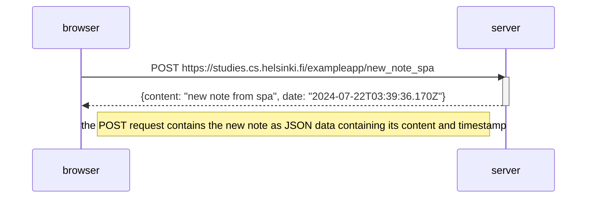

```mermaid
    sequenceDiagram
    participant browser
    participant server

    browser->>server: POST https://studies.cs.helsinki.fi/exampleapp/new_note_spa
    activate server
    
    server-->>browser: {content: "new note from spa", date: "2024-07-22T03:39:36.170Z"}
    deactivate server

    Note right of browser: the POST request contains the new note as JSON data containing its content and timestamp
```